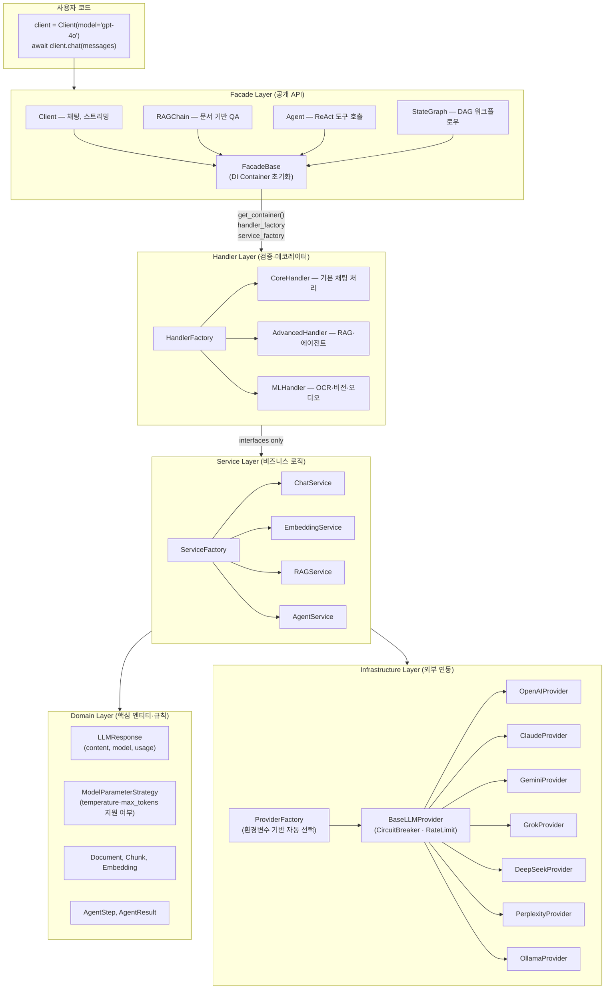
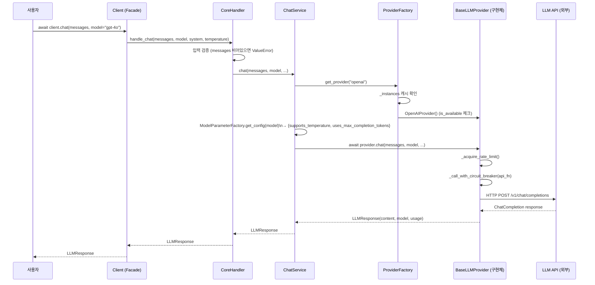
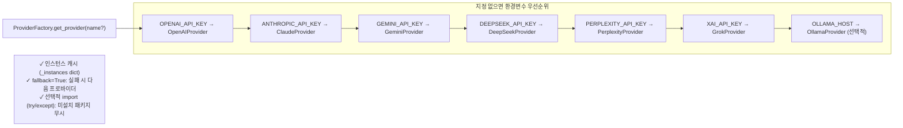

# beanllm 시스템 아키텍처 개요

beanllm은 8개 LLM 프로바이더를 단일 인터페이스로 통합하는 Python 라이브러리입니다.  
Clean Architecture를 적용하여 프로바이더 교체 시 도메인 코드 변경이 없고, HTTP 모킹 없이 80% 테스트 커버리지를 달성합니다.

---

## 레이어 아키텍처



---

## 요청 흐름 (Client.chat)



---

## 프로바이더 라우팅



**모델 이름 → 프로바이더 자동 매핑:**
```python
client = Client(model="gpt-4o")         # → OpenAIProvider
client = Client(model="claude-opus-4-8") # → ClaudeProvider
client = Client(model="grok-4.3")        # → GrokProvider
```

---

## ModelParameterStrategy (Strategy 패턴)

각 모델 시리즈마다 `temperature`, `max_tokens` 파라미터 지원 여부가 다릅니다. 하드코딩 대신 Strategy 패턴으로 확장합니다.

```
ModelParameterFactory.get_config("gpt-5-nano")
  → extract_base_model("gpt-5-nano-2025-08-07") = "gpt-5-nano"
  → 우선순위 패턴 매칭: "gpt-5-nano" → NanoModelStrategy
  → {supports_temperature: False, supports_max_tokens: False}

ModelParameterFactory.get_config("gpt-4o-mini")
  → "mini" 패턴 매칭 → MiniModelStrategy
  → {supports_temperature: False, supports_max_tokens: True}

ModelParameterFactory.get_config("gpt-4o")
  → 매칭 없음 → DefaultModelStrategy
  → {supports_temperature: True, supports_max_tokens: True}
```

| 전략 | 적용 모델 | temperature | max_tokens | max_completion_tokens |
|------|---------|-------------|-----------|----------------------|
| `GPT5Strategy` | gpt-5 | ✓ | ✗ | ✓ |
| `GPT41Strategy` | gpt-4.1 | ✓ | ✗ | ✓ |
| `NanoModelStrategy` | *-nano | ✗ | ✗ | ✗ |
| `MiniModelStrategy` | *-mini | ✗ | ✓ | ✗ |
| `O3ModelStrategy` | o3 | ✗ | ✓ | ✗ |
| `DefaultModelStrategy` | 나머지 | ✓ | ✓ | ✗ |

---

## BaseLLMProvider 공통 기능

모든 프로바이더 구현체가 `BaseLLMProvider`를 상속합니다.

| 기능 | 구현 | 설명 |
|------|------|------|
| **Circuit Breaker** | `CircuitBreaker` (per-provider) | 연속 5회 실패 → OPEN (60초 차단) → HALF_OPEN → 2회 성공 → CLOSED |
| **Rate Limiting** | `_acquire_rate_limit()` | 분산(Redis) 또는 인메모리, 실패 시 경고만 하고 계속 진행 |
| **에러 통합** | `_handle_provider_error()` | API 키 마스킹 + `ProviderError` 래핑 |
| **OpenAI 메시지 변환** | `_prepare_openai_messages()` | system 프롬프트를 messages[0]으로 삽입 |
| **Health Check** | `_safe_health_check()` | 모든 예외 캐치 → False 반환 |

---

## 선택적 의존성 (Optional Extras) 구조

```
pip install beanllm              # 핵심만 (~5MB): httpx, pydantic, tiktoken, PyMuPDF
pip install beanllm[openai]      # + openai SDK
pip install beanllm[anthropic]   # + anthropic SDK
pip install beanllm[gemini]      # + google-generativeai
pip install beanllm[ml]          # + torch, marker-pdf (ML-based PDF)
pip install beanllm[ragpro]      # + semantic + colbert + DB drivers
pip install beanllm[all]         # 전체 (모든 프로바이더 + CLI + MCP)
```

프로바이더 SDK는 `try/except`로 선택적 import — 미설치 시 `WARNING` 로그만 남기고 해당 프로바이더만 비활성화합니다.

---

## 테스트 전략

| 레이어 | 테스트 방식 | HTTP 모킹 필요 |
|--------|-----------|--------------|
| Domain (LLMResponse, Strategy) | 단위 테스트 | ✗ |
| Service (ChatService, RAGService) | 단위 테스트 + MockProvider | ✗ |
| Handler | 단위 테스트 | ✗ |
| Provider (OpenAI 등) | `pytest-mock` + httpx mock | ✓ (Provider 레이어만) |
| Facade (통합) | MockProvider 주입 | ✗ |

Clean Architecture 덕분에 **HTTP 모킹은 Provider 레이어에만 집중** → 전체 6,340개 테스트 중 대다수가 실제 API 호출 없이 실행됩니다.
