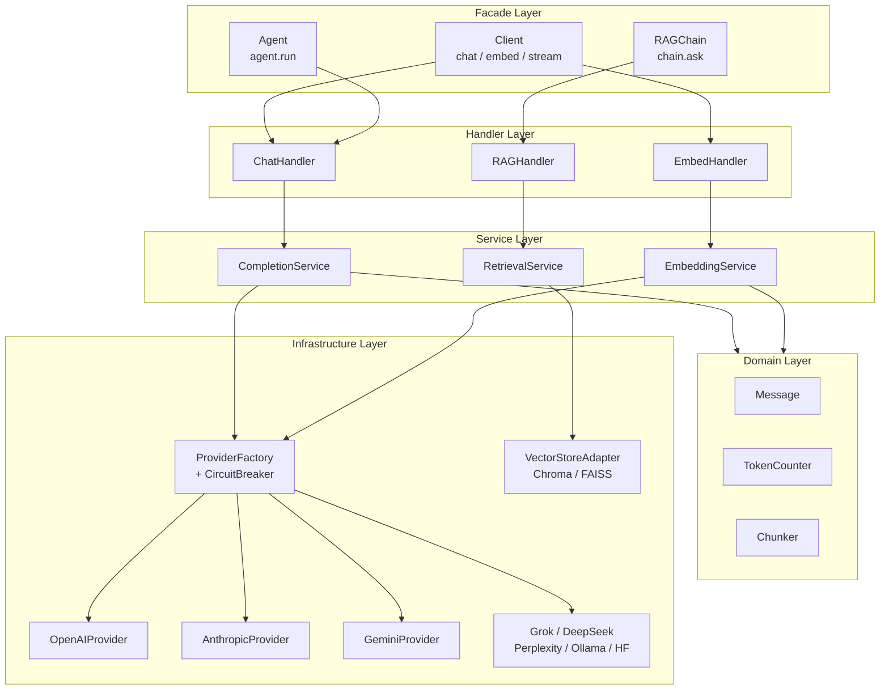
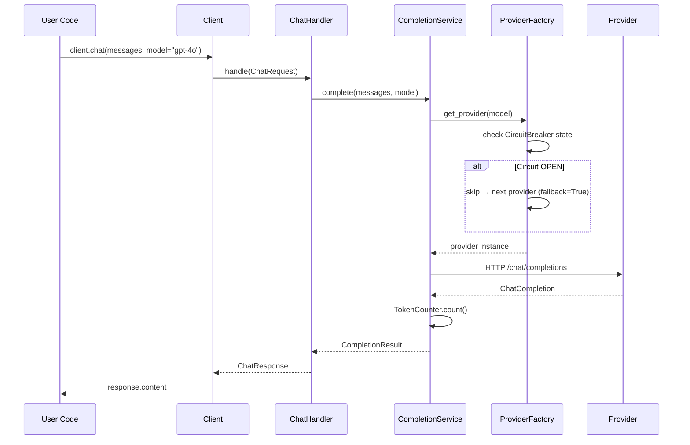

# beanllm Wiki

8개 LLM 프로바이더를 단일 인터페이스로 통합하는 Python 라이브러리.

## Architecture

## Request Flow

## Domain Pages

| 도메인 | 설명 | 문서 |
|--------|------|------|
| Architecture | Clean Architecture + 레이어 규칙 | [architecture.md](architecture.md) |
| Providers | 8개 프로바이더 + CircuitBreaker | [providers.md](providers.md) |
| Facade API | Client, RAGChain, Agent, StateGraph | [facade.md](facade.md) |
| Testing | 레이어별 테스트 전략 | [testing.md](testing.md) |
| Contributing | 새 프로바이더 추가 방법 | [contributing.md](contributing.md) |
