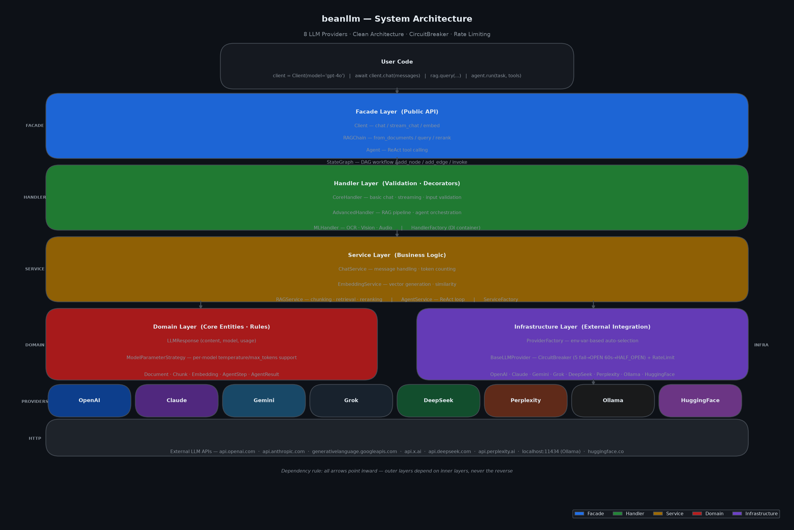

# Architecture

beanllm은 Clean Architecture를 적용하여 프로바이더 교체 시 도메인 코드 변경 없이 80% 테스트 커버리지를 달성합니다.



---

## 레이어 구조

의존성은 항상 바깥쪽에서 안쪽으로만 흐릅니다. 안쪽 레이어는 바깥쪽 레이어를 모릅니다.

```
Facade → Handler → Service → Domain
                ↑
          Infrastructure (Domain 인터페이스 구현)
```

### Facade Layer — 공개 API

**위치:** `src/beanllm/facade/`

사용자가 직접 사용하는 진입점. 내부 복잡성을 단순한 인터페이스로 감쌉니다.

| 클래스 | 역할 |
|--------|------|
| `Client` | 채팅, 스트리밍, 임베딩 |
| `RAGChain` | 문서 기반 QA 파이프라인 |
| `Agent` | ReAct 패턴 도구 호출 |
| `StateGraph` | DAG 워크플로우 실행 |

모든 Facade는 `FacadeBase`를 상속합니다. `FacadeBase.get_container()`가 DI 컨테이너를 초기화하고 `HandlerFactory`와 `ServiceFactory`를 제공합니다.

### Handler Layer — 검증·라우팅

**위치:** `src/beanllm/handler/`

입력 검증, 데코레이터 적용, 서비스 라우팅을 담당합니다.

| 핸들러 | 책임 |
|--------|------|
| `CoreHandler` | 기본 채팅·스트리밍 처리 |
| `AdvancedHandler` | RAG 파이프라인·에이전트 오케스트레이션 |
| `MLHandler` | OCR·비전·오디오 처리 |

`HandlerFactory`가 적절한 핸들러 인스턴스를 생성합니다.

### Service Layer — 비즈니스 로직

**위치:** `src/beanllm/service/`

핵심 비즈니스 로직을 담습니다. 인터페이스에만 의존하여 프로바이더 교체가 자유롭습니다.

| 서비스 | 책임 |
|--------|------|
| `ChatService` | 메시지 처리, 토큰 카운팅 |
| `EmbeddingService` | 벡터 생성, 유사도 계산 |
| `RAGService` | 청킹, 검색, 리랭킹 |
| `AgentService` | ReAct 루프 실행 |

`ServiceFactory`가 적절한 서비스를 생성하여 주입합니다.

### Domain Layer — 핵심 엔티티·규칙

**위치:** `src/beanllm/domain/`

순수 Python. 외부 의존성 없음. 가장 안정적인 레이어.

| 엔티티 | 역할 |
|--------|------|
| `LLMResponse` | `content`, `model`, `usage` |
| `ModelParameterStrategy` | 모델별 temperature/max_tokens 지원 여부 |
| `Document`, `Chunk` | RAG 처리 단위 |
| `AgentStep`, `AgentResult` | 에이전트 실행 추적 |

### Infrastructure Layer — 외부 연동

**위치:** `src/beanllm/providers/`

외부 LLM API 연동. Domain 인터페이스를 구현합니다.

- `BaseLLMProvider` — CircuitBreaker + RateLimit 내장 추상 클래스
- `ProviderFactory` — 환경변수 기반 프로바이더 자동 선택
- 각 프로바이더 구현체 (`OpenAIProvider`, `ClaudeProvider`, ...)

---

## DI Container 패턴

```python
class FacadeBase:
    def get_container(self):
        """의존성 컨테이너 초기화 (지연 생성)"""
        if self._container is None:
            self._container = DIContainer(
                handler_factory=HandlerFactory(),
                service_factory=ServiceFactory(),
            )
        return self._container
```

`Client`, `RAGChain`, `Agent`는 모두 `FacadeBase.get_container()`를 통해 HandlerFactory와 ServiceFactory를 받습니다. 직접 인스턴스화하지 않으므로 테스트 시 Mock 주입이 쉽습니다.

---

## Factory 패턴

| 팩토리 | 위치 | 역할 |
|--------|------|------|
| `HandlerFactory` | `handler/` | 핸들러 인스턴스 생성 |
| `ServiceFactory` | `service/factory.py` | 서비스 인스턴스 생성 |
| `ProviderFactory` | `providers/provider_factory.py` | 프로바이더 인스턴스 생성·캐싱 |

---

## 소스 디렉토리 구조

```
src/beanllm/
  facade/
    core/          client_facade.py, rag_facade.py, agent_facade.py
    advanced/      state_graph_facade.py, multi_agent_facade.py, ...
    ml/            audio_facade.py, vision_rag_facade.py, ...
    base.py        FacadeBase (DI 컨테이너)
  handler/
    core/          CoreHandler
    advanced/      AdvancedHandler
    ml/            MLHandler
  service/
    chat_service.py, rag_service.py, agent_service.py, ...
    factory.py     ServiceFactory
  domain/
    embeddings/    벡터 도메인
    state_graph/   StateGraph 도메인
    tools/         Tool, ToolRegistry
  providers/
    base_provider.py      BaseLLMProvider (추상)
    provider_factory.py   ProviderFactory
    openai_provider.py, claude_provider.py, ...
  decorators/
    error_handler.py, validation.py, logger.py
  dto/
    response/      ChatResponse, RAGResponse, ...
  infrastructure/
    registry/      ModelRegistry
```

---

## 관련 문서

- [Providers](providers.md) — 8개 프로바이더 + CircuitBreaker 상세
- [Facade API](facade.md) — 공개 API 사용 방법
- [ADR-001](../docs/adr/ADR-001-clean-architecture.md) — Clean Architecture 채택 결정
